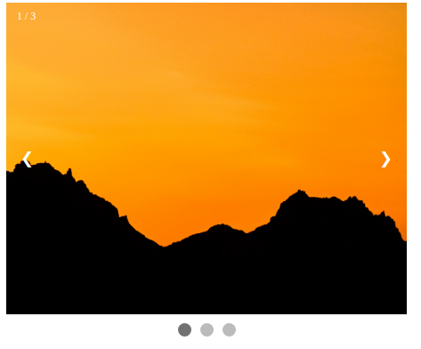

# Image Slider &middot;    

<div align="center">
<p>A small JS library for creating image carousels.</p>



<div>
    <a href="https://npm.runkit.com/%40lindelwa122%2Fimage-slider">Try on RunKit</a>
    &middot;
    <a href="https://github.com/lindelwa122/image-slider/issues">Report Bugs</a>
    &middot;
    <a href="https://github.com/lindelwa122/image-slider/issues">Request Feature</a>
</div>

</div>

## About the Project

The Image Slider library provides a user-friendly solution for creating highly customizable image carousels that seamlessly integrate with a wide range of projects. Its flexibility allows for easy configuration, making it a versatile choice for various scenarios.

## Installation

Install using NPM:

```
npm install @lindelwa122/image-slider
```

## Usage

### Creating a Slider

Creating a customized image carousel with the Image Slider library is a straightforward process. Begin by implementing the slider as shown below:

```javascript
import imageSlider from '@lindelwa122/image-slider';
import image1 from './images/image-1.png';
import image2 from './images/image-2.png';

const slider = imageSlider(
  '350px',
  '450px',
  { src: 'https://unsplash/image.png', alt: '' },
  { src: image1, alt: '' },
  { src: image2, alt: '' },
);
```

In this example, the `imageSlider` function is invoked by providing the desired height and width for the carousel container, followed by the images to be used in the carousel. The images can be specified using various formats, including URLs or local paths.

### Creating a Square Container

You can achieve a square carousel container by providing either the height or width while invoking `imageSlider`. If neither is provided, an error will be thrown. This feature is handy for creating responsive square containers. Here's an example:

```javascript
import imageSlider from '@lindelwa122/image-slider';
import image1 from './images/image-1.png';
import image2 from './images/image-2.png';

const slider = imageSlider(
  undefined,
  '30%',
  { src: 'https://unsplash/image.png', alt: '' },
  { src: image1, alt: '' },
  { src: image2, alt: '' },
);
```

In the example above, the width is set to 30% while the height is set to `undefined`. This will create a square container that's responsive to the page, with the height and width being equal.

You can also set the width to `undefined` and define the height as needed, achieving the same square container result.

Setting both height and width to `undefined` will make the carousel container take up 100% of the parent container's width, and the height will adjust based on the images. The carousel container behaves as a `block` element in this scenario.

### Image Format

For the image to be properly recognized, it should be in the following format: `{ src: 'https://unsplash/image.png', alt: ''}`. If the `src` key is not found in the provided `object` or if an item in the `images` array is not an object, an error will be thrown. While `alt` is not a mandatory field, it is highly recommended you provide it for improved accessibility.

### Updating Configurations

The `imageSlider` module comes with default configurations that define its behavior. These configurations can be easily updated to tailor the image slider to your specific project requirements.

The default configurations are as follows:

```javascript
{
    animation: true,
    animationDuration: 500,
    imageFit: 'cover',
    showCounter: true,
    showControls: true,
    showDots: true,
}
```

- **animation**: A boolean indicating whether to enable animation.
- **animationDuration**: The duration of the animation in milliseconds.
- **imageFit**: The image fit mode, using values such as 'cover', 'contain', 'fill', or 'none'.
- **showCounter**: A boolean indicating whether to display the image counter.
- **showControls**: A boolean indicating whether to display navigation controls.
- **showDots**: A boolean indicating whether to display navigation dots.

To update configurations, simply provide an object with the configurations you wish to change, like this:

```javascript
slider.updateConfig({ animation: false, imageFit: 'contain' });
```

In this example, animation is disabled and the image fitting is set to 'contain'.

Note that most configurations are boolean values, except for `animationDuration` (number) and `imageFit` (string). The `imageFit` uses values such as 'cover', 'contain', 'fill', or 'none' based on the CSS `object-fit` property.

### Automatically Advancing Slides

You can set up the image slider to automatically advance the slides at a specified interval using the `auto` function:

```javascript
slider.auto(2000);
```

The `auto` function takes a parameter `ms` (milliseconds), indicating the time interval between slide transitions. By default, the interval is set to 1000 milliseconds (1 second). The function returns an interval ID, which can be used with `clearInterval` to stop the automatic slide transitions at any time:

```javascript
const intervalId = slider.auto(2000); // Start auto-advancing every 2 seconds

// Stop auto-advancing after 10 seconds
setTimeout(() => {
  clearInterval(intervalId);
}, 10000);
```

In this example, the slider will automatically transition to the next image every 2 seconds. After 10 seconds, we use `clearInterval` to stop the automatic advancement.

This feature is useful when you want to create a self-advancing image carousel without requiring user interaction.

### Adding the Image Slider to a Page

To display the image slider on a web page, you can use the `append` function provided by the image slider module. This function appends the slider to a specified parent element based on a selector.

Here's how you can use `append` to display the image slider:

```javascript
slider.append('#root');
```

In this example, the image slider will be appended to the element with the ID `root`. Make sure that the specified selector corresponds to an existing element in your HTML, or an error will be thrown.

This function simplifies integrating the image slider into your web page, allowing for easy and seamless display of the image carousel.

## Examples

### Full Example: Using Image Slider Library

Here's a complete example demonstrating how to use the Image Slider library:

```javascript
import imageSlider from '@lindelwa122/image-slider';
import image1 from './images/image-1.png';
import image2 from './images/image-2.png';

const slider = imageSlider(
  '350px',
  '450px',
  { src: image1, alt: 'Cat climbing a tree' },
  { src: image2, alt: 'Dog sleeping under a tree' },
);

// Automatically advance the slide every 2 seconds
slider.auto(2000);

// Update the image fit to 'contain'
slider.updateConfig({ imageFit: 'contain' });

// Append the slider to an element with ID 'root'
slider.append('#root');
```

### Slideshow Example: Using Image Slider as a Slideshow

You can use the Image Slider to create a slideshow and disable control options. Here's an example:

```javascript
import imageSlider from '@lindelwa122/image-slider';
import image1 from './images/image-1.png';
import image2 from './images/image-2.png';

const slider = imageSlider(
  '350px',
  '450px',
  { src: image1, alt: 'Cat climbing a tree' },
  { src: image2, alt: 'Dog sleeping under a tree' },
);

// Automatically advance the slide every 5 seconds
slider.auto(5000);

// Update configurations to hide controls, dots, and counter
slider.updateConfig({
  showCounter: false,
  showControls: false,
  showDots: false,
});

// Append the slider to an element with ID 'root'
slider.append('#root');
```

In this example, the images will automatically update every 5 seconds, and the user won't have control over manual image changes since controls, dots, and the counter are hidden.

## Contributing

Contributions are welcome, if you have any ideas of how can we make this project better please create an [issue](https://github.com/lindelwa122/image-slider/issues).

## Contact

- GitHub: https://github.com/lindelwa122
- Email: nqabenhlemlaba22@gmail.com
- Instagram: [https://instagram.com/q.codes\_\_](https://instagram.com/q.codes__)

## Acknowledgements

- Project inspired by [The Odin Project's](https://theodinproject.com) exercise.
